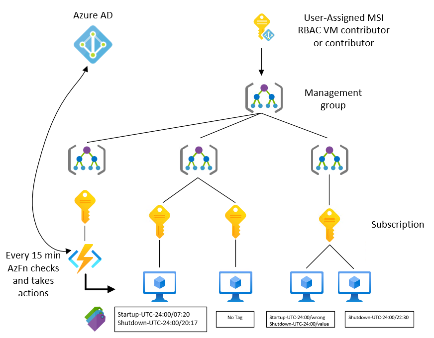
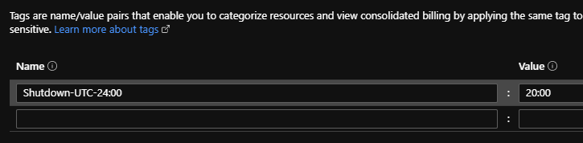
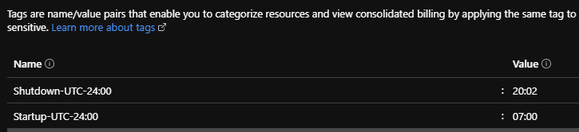
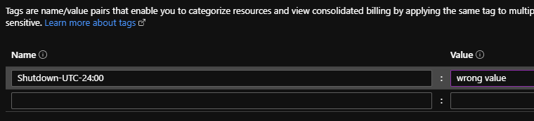

# DynamicVMPowerControl

author: François Leon

## Introduction

So what is the purpose of this badass name (I have no imagination for names...). Most of the shutdown/Startup ideas that I see over internet seem too complicated, not secure enough or not granular enough when you have a big organization with a lot of subscriptions to govern. I wanted to provide my users a simple process to follow and dynamic enough to allow them to start/stop their VMs when they want in a secure way.

## High level concept

1- All my subscriptions belong to a management group hierarchy. This allow me to apply RBAC on all of subscriptions easily.

2- This is how I push a user-assigned MSI on all RBAC tables.

3- Let’s now define a standard that we will share to the whole company.

    3.1 Use two specific tags if you’re interested to start or stop your VM.
    3.2 To be effective, tag value must use the format ‘24:00’.

In other words, 2 tags will be shared (**Startup-UTC-24:00/Shutdown-UTC-24:00**) and people will be able to choose their value. The nice thing with tags is that it’s shared across subscriptions.

4- Now that you know what you’re looking for, what is the quickest way to inventory your Azure organization? Graph explorer! Let’s use a query like this:

```powershell 
$Query = @"
resources
| where type == "microsoft.compute/virtualmachines"
and isnotnull(tags['Shutdown-UTC-24:00'])
"@
```

5- Now that you have an array of all VMs with this specific tag, it’s piece of cake to grab the tag value and other information on each VM like resource group, VM name and of course the subscription Id.

6- How you run this? Azure function (time trigger) will give me the flexibility to log as the MSI, run the graph query, compute this info and do actions for me!

If you prefer pictures:



## In plain text, what does it means?

Every 15 min I have 2 functions (Start and Stop) who run under a security context that we can’t control (Microsoft does it for us).  Each function lists all VMs with correct tagging within all subscriptions through graph explorer, filter bad value (to avoid mistyping) and make sure your machines belong to the specified time chunk. Then for each subscription in the previous list, we will start/stop each VM.

## Highlights

* You can find the code [here](https://github.com/SCOMnewbie/Azure/tree/master/Function/VMPowerControl).
* The profile.ps1 has been modified:
    * To be able to use the MSI user, you have to replace the string '--MSUUserObjectId--' with the objectId of your MSI. Later the pipeline will take care of this.
    * 2 MSFT functions have been added for later usage
* The requirements.psd1 has been modified to add the module 'Az.ResourceGraph' when an instance start.
* In the functionApp settings, I’ve set the MSI user (bless the new UI)
* No credentials to store, Azure AD manage everything.

## Examples

### If you want to shutdown your VM at 20:00 UTC



### If you want to shutdown your VM at 20:02 and start it at 07:00 UTC



:warning: The order to shutdown the VM will be at 20:15, not 20:02 !

### If you don't read what you type



:vertical_traffic_light: Your machine won't receive any order. A warning message will be triggered in logs.

## Possible improvement (work in progress)

* Implementing Tests for the 2 functions
* Create the pipeline to deploy the function App with AzDo
* Send messages (write-host|warning|error) to a centralize log analytics with Rest API.
