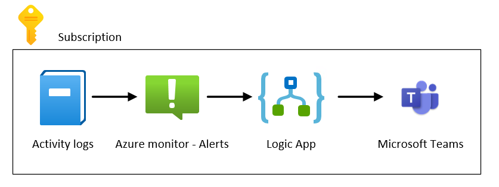
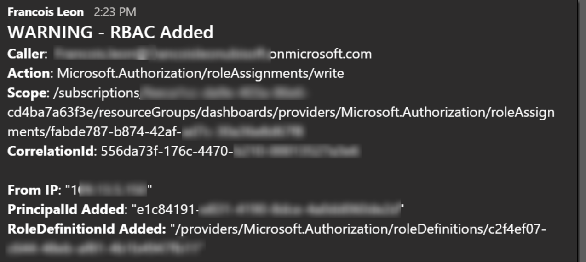

# How to be warned for all RBAC changes over Teams in real time

author: François leon

## Introduction

The idea is to be warned when an owner add/remove grant a new role to someone.

The solution based on:
* Azure monitor (Alerts) with specific events we want to subscribe to on activity logs.
* Logic App to compute the event triggered.
* A Teams channel to receive the warning message

If you prefer picture:

:vertical_traffic_light: When a user grant or remove access, the events generated don’t use the same schema … In other words, therefore I had to duplicate my action group and my Logic App because the way to compute the event is not the same.

:vertical_traffic_light: To get your Teams GroupId and ChannelId if you don’t want to use Powershell or another admin tool, you can simply right click on your group and choose “Get link to channel”.

The flow is simple:

1- Someone grant/remove access to a scope (Sub, RG, Resource).

2- An event appears in the activity logs which trigger one of the 2 alerts.

3- Depending of the event type, Azure monitor trigger one of the 2 logic App.

4- The logic App compute the event and create a message in a specific Teams Channel

## Deployment

:warning: If you deploy the template, you will have to “Authorize” your Teams connection at the first deployment. You simply have to go into the RG, click on the Teams connector and then click on “edit API connection”. From here you can Authorize your connection.

## Result

## Other ideas

:vertical_traffic_light: I did not test it, but I’m pretty sure you can generate an alert if you change the scope from the subscription to the **management group level**. In other word, you can track what is happening on all your subscriptions. 

:vertical_traffic_light: All variables are already prepared, so if you do not like Teams, you can change the connector and **select instead Slack, a database, or something else easily**.
